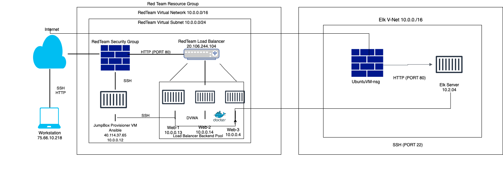

## Automated ELK Stack Deployment

The files in this repository were used to configure the network depicted below.

These files have been tested and used to generate a live ELK deployment on Azure. They can be used to recreate the entire deployment pictured above. Alternatively, select portions of the yml playbook files may be used to install only certain pieces of it, such as Filebeat.

This document contains the following details: 

- Description of the Topology
- Access Policies
- ELK Configuration
  - Beats in Use
  - Machines Being Monitored
- How to Use the Ansible Build

### Description of the Topology

The main purpose of this network is to expose a load-balanced and monitored instance of DVWA, the D*mn Vulnerable Web Application.

Load balancing ensures that the application will be highly available, in addition to restricting traffic to the network.
- Load Balancers help to defend against DDOS attacks by working to ensure the availability and web security of a system. Using a jumpbox provides automation and access control in a hardened environment.

Integrating an ELK server allows users to easily monitor the vulnerable VMs for changes to the logs and system traffic.
- Filebeat monitors systems against a baseline, centralizes, and collects the data.
- Metricbeat collects metric data from the OS and servers.

The configuration details of each machine may be found below.

| Name     | Function | IP Address | Operating System |
|----------|----------|------------|------------------|
| JumpBox  | Gateway  | 10.0.0.1   | Linux/Ubtuntu    |
| Web-1    |Web Server| 10.0.0.12  | Linux/Ubuntu     |
| Web-2    |Web Server| 10.0.0.14  | Linux/Ubuntu     |
| Web-3    |Web Server| 10.0.0.4   | Linux/Ubuntu     |
| UbuntuVM |Elk Server| 10.2.0.4   | Linux/Ubuntu     |

### Access Policies

The machines on the internal network are not exposed to the public Internet. 

Only the Jumpbox Provisioner machine can accept connections from the Internet. Access to this machine is only allowed from the following IP addresses:
40.114.37.65

Machines within the network can only be accessed by the Jumpbox Provisioner VM.
- The Jumpbox Provisioner VM has access to the Elk VM. The Jumpbox Provisioner VM's IP address is 10.0.0.12.

A summary of the access policies in place can be found in the table below.

| Name     | Publicly Accessible | Allowed IP Addresses |
|----------|---------------------|----------------------|
| JumpBox  | No                  |     40.114.37.65     |
| Web-1    | No                  |      10.0.0.13       |
| Web-2    | No                  |      10.0.0.14       |
| Web-3    | No                  |      10.0.0.4        |
| UbuntuVM | No                  |      10.2.0.4        |

### Elk Configuration

Ansible was used to automate configuration of the ELK machine. No configuration was performed manually, which is advantageous because it allows IT professionals to automate their daily tasks which frees up a lot of time for them to focus on more pressing matters.

The playbook implements the following tasks:
- Install Docker
- Increase Memory
- Install python3-pip

The following screenshot displays the result of running `docker ps` after successfully configuring the ELK instance.

### Target Machines & Beats
This ELK server is configured to monitor the following machines:
- Web-1: 10.0.0.13
- Web-2: 10.0.0.14

We have installed the following Beats on these machines:
- Filebeat
- Metricbeat

These Beats allow us to collect the following information from each machine:
- Filebeat collects log data. From this you would expect to see all network traffic. Using filebeat would show any traffic that deviates from system baselines.
- Metricbeat collects metric data such as CPU and disk usage.

### Using the Playbook
In order to use the playbook, you will need to have an Ansible control node already configured. Assuming you have such a control node provisioned: 

**FOR ANSIBLE**

SSH into the control node and follow the steps below:
- Copy the Ansible Configuration & Install-Elk files to /etc/anible.
- Update the hosts file to include 

  10.0.0.12 ansible_python_interpreter=/usr/bin/python3

  12.0.0.13 ansible_python_interpreter=/usr/bin/python3

  14.0.0.14 ansible_python_interpreter=/usr/bin/python3 

  [elk]
  
  
  10.2.0.4 ansible_python_interpreter=/usr/bin/python3

- Run the playbook using ansible-playbook install-elk.yml

**FOR FILEBEAT**

-Download Filebeat playbook using this command:
curl -L -O https://gist.githubusercontent.com/slape/5cc350109583af6cbe577bbcc0710c93/raw/eca603b72586fbe148c11f9c87bf96a63cb25760/Filebeat > /etc/ansible/filebeat-config.yml

-Update the filebeat-playbook.yml file to include installer
curl -L -O https://artifacts.elastic.co/downloads/beats/filebeat/filebeat-7.6.1-amd64.deb

-Update the filebeat-config.yml file via nano filebeat-config.yml to include:

     output.elasticsearch:

     #Array of hosts to connect to.
  
     hosts: ["10.2.0.4:9200"]
 
      username: "elastic"
  
      password: "changeme”
  

     setup.kibana:
 
     host: "10.2.0.4:5601"

-Run the playbook using ansible-playbook metribeat-playbook.yml, and navigate to http://20.98.100.207:5601/app/kibana to check that the installation worked as expected.

  
**FOR METRIC BEAT**

-Download Metricbeat playbook using this command:
curl -L -O https://gist.githubusercontent.com/slape/58541585cc1886d2e26cd8be557ce04c/raw/0ce2c7e744c54513616966affb5e9d96f5e12f73/metricbeat > /etc/ansible/files/metricbeat-config.yml

-Copy the /etc/ansible/metricbeat file to /etc/metricbeat/metricbeat-playbook.yml
Update the filebeat-playbook.yml file to include installer
curl -L -O https://artifacts.elastic.co/downloads/beats/metricbeat/metricbeat-7.6.1-amd64.deb

-Update the metricbeat file rename to metricbeat-config.yml via nano metricbeat-config.yml to include:

    output.elasticsearch:

    #Array of hosts to connect to.

    hosts: ["10.2.0.4:9200"]

    username: "elastic"
  
    password: "changeme"

    setup.kibana:

     host: "10.2.0.4:5601"

  
 

- The following yml files hold all of our playbooks. They need to be copied and ran within an Ansible container.

  -[Filebeat Playbook](Ansible/filebeat-playbook.yml)
  
  -[Installing Elk](Ansible/install-elk.yml)
  
  -[Metricbeat Playbook](Ansible/metricbeat-playbook.yml)

- Which file do you update to make Ansible run the playbook on a specific machine? How do I specify which machine to install the ELK server on versus which to install Filebeat on?
 
  -  You would need to update the host file. When you update the host file in the ansible directory you will need to create a new group called [elk] and add the private IP of the elk server. When configuring filebeat, the private IP address needs to be added to lines 1106 and 1806 to ensure access.

- Which URL do you navigate to in order to check that the ELK server is running?

  - http://[your.ELK-VM.External.IP]:5601/app/kibana 

**NECESSARY COMMANDS & THEIR PURPOSE**

sudo apt-get update---this will update all packages

sudo apt install docker.io---install docker application

sudo service docker start---start the docker application

systemctl status docker---status of the docker application

sudo docker pull cyberxsecurity/ansible---download the docker file

sudo docker run -ti cyberxsecurity/ansible bash---run and create a docker image

sudo docker start <image-name>---starts the image specified
  
sudo docker ps -a---list all active/inactive containers
  
sudo docker attach <image-name>---effectively ssh into the ansible
  
ssh-keygen---generate an ssh key
  
ansible -m ping all---check the connection of ansible containers
  
nano <filename>---edit file
